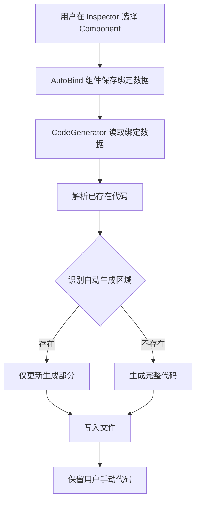

## Product Overview

Unity UI 自动绑定系统，通过编辑器工具自动检测并生成 UI 组件引用代码，支持代码增量更新保留用户手动编辑内容，简化 UI 开发流程。

## Core Features

- AutoBind 组件：支持 Inspector 中下拉选择绑定的 Component 类型
- ScriptableObject 配置：管理代码生成路径、命名空间、父类/接口
- 编辑器工具：提供代码生成界面和批量处理功能
- 代码生成器：自动生成绑定代码，仅更新生成部分，保留手动编辑
- 支持 Unity 内置及用户自定义 Component 类型
- 生成类自动添加指定父类或接口

## Tech Stack

- 开发语言：C#
- 框架：Unity Editor API
- UI 框架：Unity IMGUI/UIToolkit

## System Architecture

### 系统架构

采用分层架构模式：数据层 → 业务逻辑层 → 表现层

- 数据层：AutoBindData 存储绑定配置，ScriptableObject 持久化
- 业务逻辑层：CodeGenerator 处理代码生成和更新
- 表现层：AutoBindEditor 提供编辑器交互界面

### Module Division

- **AutoBind 模块**：核心组件，负责挂载到 UI 物体上存储绑定信息
- 技术：MonoBehaviour, SerializeField
- 接口：GetComponent 获取绑定数据

- **Config 模块**：配置管理，统一管理生成参数
- 技术：ScriptableObject
- 职责：路径模板、命名空间、父类/接口配置

- **Editor Tools 模块**：编辑器工具，提供可视化操作
- 技术：Unity Editor API, IMGUI
- 职责：Inspector 扩展、窗口界面

- **CodeGenerator 模块**：代码生成器，解析和生成 C# 代码
- 技术：字符串处理、文件 I/O
- 职责：模板生成、代码区域识别和更新

### Data Flow



## Implementation Details

### Core Directory Structure

```
CUiAutoBind/
├── Runtime/
│   ├── AutoBind.cs              # AutoBind 组件
│   ├── AutoBindData.cs          # 绑定数据结构
│   └── BindConfig.cs            # ScriptableObject 配置类
├── Editor/
│   ├── AutoBindEditor.cs        # Inspector 编辑器扩展
│   ├── AutoBindWindow.cs        # 代码生成窗口
│   └── CodeGenerator.cs         # 代码生成器
└── README.md                    # 使用文档
```

### Key Code Structures

**AutoBindData**: 绑定数据结构

```
[System.Serializable]
public class AutoBindData
{
    public string componentName;
    public string variableName;
    public System.Type componentType;
}
```

**BindConfig**: ScriptableObject 配置

```
public class BindConfig : ScriptableObject
{
    public string namespace = "UI";
    public string basePath = "Scripts/UI/";
    public string baseClass = "MonoBehaviour";
    public string[] interfaces;
}
```

**CodeGenerator.GenerateCode**: 代码生成接口

```
public static class CodeGenerator
{
    public static void GenerateCode(GameObject target, BindConfig config)
    {
        // 解析绑定数据
        // 识别自动生成区域
        // 生成或更新代码
    }
}
```

### Technical Implementation Plan

1. **AutoBind 组件实现**

- Problem: 需要支持 Inspector 下拉选择 Component 类型
- Solution: 使用 SerializedProperty 和 Component 类型过滤
- Steps: 创建 MonoBehaviour，添加 [SerializeReference] 字段，实现自定义 PropertyDrawer
- Testing: 在 Inspector 中验证类型选择功能

2. **代码增量更新**

- Problem: 需要保留用户手动编辑的代码
- Solution: 使用标记区域（#region AutoBindGenerated）识别生成部分
- Steps: 解析现有文件，查找区域标记，仅更新区域内容
- Testing: 手动添加代码后重新生成，验证保留效果

3. **父类/接口支持**

- Problem: 生成的类需要继承指定父类或接口
- Solution: 在模板中动态插入父类/接口声明
- Steps: 配置类添加接口数组，生成时拼接类声明
- Testing: 配置父类和接口，验证生成的类声明格式

### Integration Points

- **Unity Editor**: 使用 UnityEditor 命名空间下的 API
- **文件系统**: 使用 System.IO 进行代码文件读写
- **反射机制**: 使用 System.Reflection 处理 Component 类型

## Agent Extensions

### Skill

- **skill-creator**
- Purpose: 创建 CUiAutoBind 的 Skill 定义，便于未来扩展和复用
- Expected outcome: 生成完整的 Skill 文件，包含该工具的使用指南和能力描述